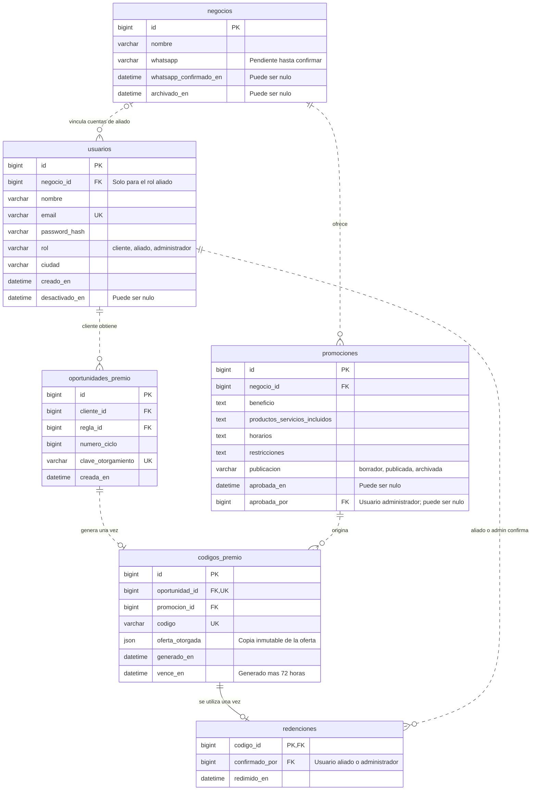
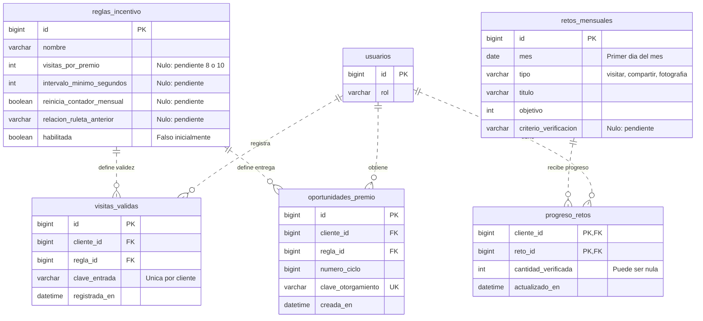

# Modelo relacional propuesto · Chapitour te premia

Propuesta para una futura base de datos de pruebas MySQL/MariaDB. Este documento no crea tablas, no conecta la aplicación y no modifica la base de datos principal. El prototipo continúa usando sesiones PHP.

**PK**: identifica un registro. **FK**: referencia a otra tabla. **UK**: valor que no puede repetirse. Las relaciones 1:N permiten varios registros hijos; 1:0..1 permite como máximo uno.

## 1. Cuentas, negocios y premios



Además de las relaciones principales dibujadas, `promociones.aprobada_por` referencia `usuarios.id`. La aprobación se registra por un administrador después de confirmar los datos con el negocio; no implica una aprobación automática del aliado.

El dueño de un código se obtiene por `codigos_premio.oportunidad_id → oportunidades_premio.cliente_id`. Su negocio se obtiene por `codigos_premio.promocion_id → promociones.negocio_id`. No se repiten esas claves en el código, evitando que apunte a un cliente o negocio contradictorio.

## 2. Visitas y retos mensuales



`usuarios` y `oportunidades_premio` aparecen en ambos diagramas para explicar las conexiones. Son las mismas tablas: hay **10 tablas en total**.

## Diccionario y restricciones

| Tabla | Qué guarda | Relación o restricción esencial |
|---|---|---|
| `usuarios` | Identidad, credenciales y rol de cada cuenta. | Email único. Un aliado pertenece a un negocio; cliente y administrador no requieren negocio. |
| `negocios` | Datos del establecimiento y contacto confirmado. | Un negocio puede tener varias cuentas de aliado; cada cuenta ve únicamente su negocio. |
| `promociones` | Beneficio y condiciones vigentes de una oferta. | Pertenece a un negocio. `negocio_id` no cambia después de emitir códigos. |
| `reglas_incentivo` | Condiciones para reconocer entradas y otorgar oportunidades. | Se mantiene deshabilitada mientras existan decisiones pendientes. |
| `visitas_validas` | Historial de entradas aceptadas de cada cliente. | `UNIQUE(cliente_id, clave_entrada)`. Una recarga no basta para crear una entrada válida. |
| `oportunidades_premio` | Derecho del cliente a generar un premio de un ciclo. | `UNIQUE(cliente_id, regla_id, numero_ciclo)` y clave de otorgamiento única. |
| `codigos_premio` | Código personal, oferta otorgada y fechas de validez. | Código único y `oportunidad_id` único: una oportunidad produce como máximo un código. |
| `redenciones` | Quién aplicó la promoción y cuándo. | `codigo_id` es la PK: un código puede tener cero o una redención. |
| `retos_mensuales` | Los retos de visitar, compartir y fotografiar de cada mes. | `UNIQUE(mes, tipo)`. Se crean registros del mes nuevo conservando el historial. |
| `progreso_retos` | Avance verificado de cada cliente en un reto. | PK compuesta `(cliente_id, reto_id)`. Sin registro o cantidad nula no equivale a progreso confirmado. |

Se propone permitir varias cuentas de acceso para un negocio, sin permitir que una misma cuenta de aliado pertenezca a varios negocios. Esto es una decisión técnica revisable, no una condición comercial nueva.

## Reglas que debe aplicar la implementación

### Emisión de premios

1. No activar la regla hasta confirmar **8 o 10 entradas**, el tiempo entre entradas válidas, su relación con la regla anterior de cinco visitas y el reinicio mensual.
2. Registrar una entrada válida bajo bloqueo por cliente y regla. La clave de entrada evita reintentos duplicados, pero no sustituye la validación del intervalo de tiempo.
3. Crear la oportunidad del ciclo de forma atómica. `numero_ciclo` es una secuencia técnica del cliente y la versión de regla; no es el contador visible ni se reinicia automáticamente cada mes.
4. Al girar, bloquear la oportunidad, verificar su propietario y seleccionar solamente una promoción publicada con negocio disponible, datos comerciales confirmados y WhatsApp confirmado.
5. Crear el código y sus fechas en esa misma transacción. Si la oportunidad ya tiene un código, devolver el existente. Si no hay promociones elegibles, conservar la oportunidad sin generar un código.
6. Conservar una copia inmutable de beneficio, productos o servicios incluidos, horarios, restricciones y nombre del negocio en `oferta_otorgada`. Esta duplicación es intencional: una edición posterior no puede modificar retroactivamente un premio ganado.

Las reglas activadas deben tratarse como versiones inmutables: un cambio posterior crea otra regla. La transición de contadores entre versiones se define antes de activar ese cambio; no se asume reinicio ni arrastre.

### Tres estados del código

El estado se calcula al consultar, en este orden, sin un selector libre ni un valor almacenado que se desactualice:

```text
Existe una redención → Redimido.
No existe redención y ahora >= vence_en → Vencido.
No existe redención y ahora < vence_en → Activo.
```

`vence_en = generado_en + 72 horas`. Una redención sigue siendo Redimido aunque después pase la fecha de vencimiento. “Borrador” pertenece exclusivamente a la publicación de la promoción.

Las fechas se guardarán en UTC y se mostrarán en la zona horaria de Bogotá. El cambio de mes de los retos no altera la vigencia de los códigos.

### Confirmación de redención

En una transacción: bloquear el código, comprobar que está activo, comprobar que quien confirma es administrador o aliado del negocio correcto e insertar su única redención. La PK de `redenciones` evita una segunda utilización, pero el control de permisos y caducidad también debe ejecutarse en el servidor. No se permite borrar o revertir una redención para reactivar un código.

Abrir WhatsApp o enviar el mensaje no escribe una redención. No hace falta una tabla de mensajes de WhatsApp para este alcance.

### Retos y contador interno

Los tres retos medibles pertenecen a `retos_mensuales`. La cuarta tarjeta, “¡Volver tiene premio!”, usa las reglas e historial de visitas y no crea un reto de códigos ni una recompensa por completar todos los retos.

Visitar tres negocios no se interpreta como una visita presencial ni como entrar a su página. Compartir no demuestra veinte entregas. No se plantea verificación automática de fotos o etiquetas: los criterios quedan pendientes y no se suman avances por pulsar botones.

El contador individual se obtiene del historial de visitas aceptadas conforme a la regla confirmada. No se expone en la tarjeta del cliente. Si luego se necesita una tabla auxiliar de contadores por rendimiento, será una optimización técnica, no una nueva regla de premios.

### Cambios y eliminaciones

- Propuesta: archivar promociones con códigos emitidos y desactivar cuentas de aliados, preservando las referencias de premios y redenciones. Solo eliminar físicamente registros sin dependencias.
- La FK del negocio de una promoción emitida es inmutable. Para trasladar una oferta se crea otra promoción.
- Eliminar una cuenta de cliente exige un flujo de eliminación o anonimización de sus datos personales; no basta con cambiar `desactivado_en`. Antes de implementarlo se define qué historial debe conservarse y durante cuánto tiempo. La propuesta no fija una política de retención.
- No hay `ON DELETE CASCADE` indiscriminado sobre premios o redenciones en esta propuesta.

## Estado de esta entrega

Modelo lógico para revisar antes de preparar la migración SQL. No hay números de WhatsApp inventados, promociones adicionales, premios por completar retos ni reglas de visitas elegidas de antemano. La base de pruebas, cuando se cree, deberá estar separada de la principal y no recibir datos personales reales para probar la interfaz.
